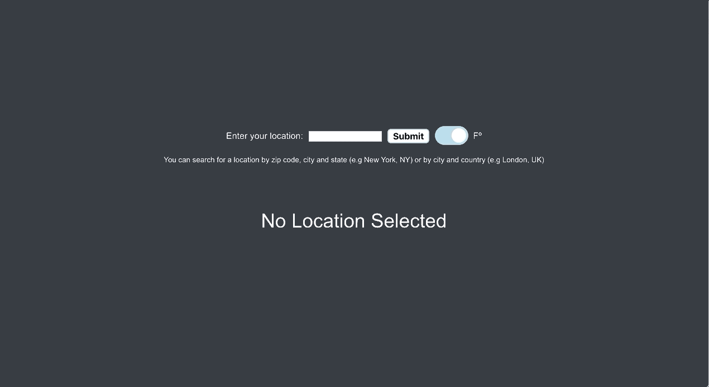
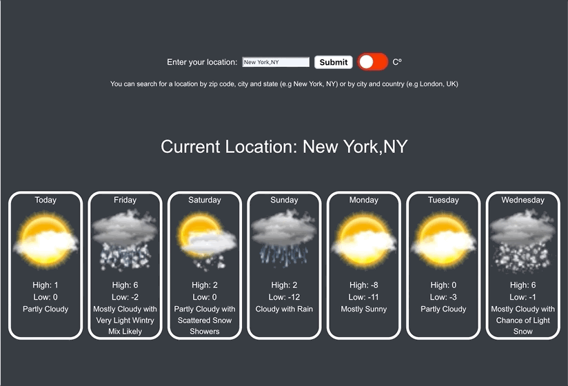

# README

## How To Run

To run this application, run the following command to clone the repository

```
git clone https://github.com/mszekalski/Weather-App.git
```

Then, cd into the folder and run this command.

```
npm run deploy
```

This will install the necessary dependencies (npm install), run the server and automatically open the application.

## Overview and Structure



The goals as laid out in the instructions were the following.

- Create single page application using React and Node.js
- Make a call to a third party API and use the response to display some data
- Implement a responsive design that works both on desktop and mobile

For my application I chose to create a simple weather app. The third party API I used in this application is called Aeris Weather. I chose this particular third-party because I found it easy to use, it provided well organized information, and even came with access to weather related icons.

## Components

I have two simple React components in my application

- An encompassing "App" component
- Each future weather forecast is also it's own component, I call these "WeatherItems"

#### App

The App component contains the the forecast form, that calls the third party API in order to get the location data.

##### WeatherItem

The App component passes down the weather data into each WeatherItem component. This allows for easy re-rendering when new data is passed down through props.

## Thoughts and Future Development

#### Responsive Design



While daunting at first I found implementing the responsive design fairly easy. I used a simply media query to adjust the CSS styling and content of my application which allowed me to adjust the content appropriatly.

#### Expanded Details

In the future I would like to add some additional components to my application, specifically a modal overlay so that a user could click on a day of the week and get more details about that day's weather. My design decision in making each WeatherItem a React component that contains data for itself allows me to implement this very easily.
